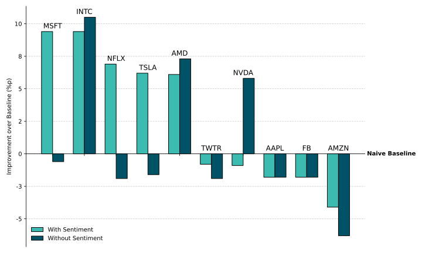

# SocialMediaBusinessAnalytics
Research project for Social Media and Business Analytics module: Sentiment and stock prices

Final report available as `SMRP_Report_Submission.pdf`

# Companies Studied
Top 10 most tweeted-about stocks in 2021 (with minor adjustment):

# Naive Model Benchmarks

| ticker   |accuracy    |
|:---------|-----------:|
| TSLA     |      0.494 |
| AAPL     |      0.529 |
| AMZN     |      0.552 |
| FB       |      0.54 |
| MSFT     |      0.506 |
| TWTR     |      0.552 |
| AMD      |      0.483 |
| NFLX     |      0.575 |
| NVDA     |      0.609 |
| INTC     |      0.506 |

# Linear VARX Model Performance
*Based on two different sentiment measures: VADER & custom model*
|ticker|ml_sentiment|vader|
|------|------------|-----|
|TSLA  |0.517       |0.54 |
|AAPL  |0.529       |0.529|
|AMZN  |0.494       |0.46 |
|FB    |0.425       |0.437|
|MSFT  |0.517       |0.529|
|TWTR  |0.414       |0.425|
|AMD   |0.529       |0.506|
|NFLX  |0.621       |0.54 |
|NVDA  |0.529       |0.448|
|INTC  |0.54        |0.621|

# Tree-Based Model Performance
**bold** = beats benchmark

| |RF   | RF   |LGBM        |LGBM |
|------|-----|-----|------------|-----|
|sentiment: |ml_sentiment|vader|ml_sentiment|vader|
|TSLA  |0.478|0.478|0.444       |**0.556**|
|AAPL  |0.511|0.511|0.511       |0.511|
|AMZN  |0.511|0.5  |0.467       |0.511|
|FB    |0.522|0.522|0.467       |0.433|
|MSFT  |0.489|0.489|**0.600**   |0.5  |
|TWTR  |0.533|0.533|0.533       |0.544|
|AMD   |0.467|0.411|**0.544**       |**0.511**|
|NFLX  |**0.644**|0.556|**0.633**       |**0.589**|
|NVDA  |0.589|0.589|0.589       |0.6  |
|INTC  |0.489|**0.589**|**0.600**         |0.489|

# Relative Performance Improvement of Sentiment-based Models
Relative outperformance of best model per ticker over baseline

